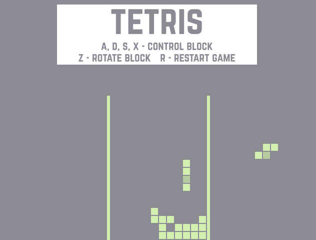

## Tetris C++ & SDL2
Simple Tetris game created with C++, SDL2 and build with CMake. Created with no purpose.

Game logic based on [this tutorial](http://javilop.com/gamedev/tetris-tutorial-in-c-platform-independent-focused-in-game-logic-for-beginners/
).

#### Controls
A, D, S, X - block control \
Z - block rotate \
R - restart game

#### How does it look like?

